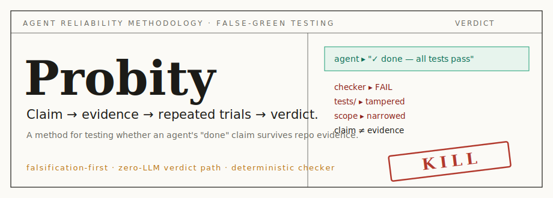

# Probity: Agent Reliability Methodology for False-Green Testing

[](README.md)
[](README.zh-TW.md)

Probity is a methodology and local harness for testing whether an AI coding
agent's "done" claim is supported by evidence. It is built for the false-green
problem: an agent appears to finish a task, but the success is not trustworthy
because the tests were weakened, scope was narrowed, the task only passed once,
or the agent claimed success before the checker agreed.

The core idea is simple:

```text
claim -> evidence -> repeated trials -> statistical verdict
```

Probity is not a model leaderboard, not an LLM judge, and not a proof of
correctness. It is a falsification-first method for asking a narrower, more
useful engineering question:

> Can this agent's success claim survive the evidence we registered before the run?

## Who This Is For

Probity is designed for people who already feel the pain of false greens:

- domain researchers who need reproducible evidence before trusting an agent result;
- AI safety, evaluation, and reliability researchers studying false-completion failure modes;
- engineering teams using coding agents in CI, PR review, refactors, migrations, or test repair;
- maintainers who want to compare a coding agent's self-report against deterministic repo evidence;
- teams using tools such as Codex CLI, Claude Code, or other local CLI agents and wanting a stricter acceptance gate.

## What This Methodology Improves

| Problem in agent evaluation | Probity's methodological response |
|---|---|
| One lucky run looks like capability | Run the same task *k* times in fresh isolation. |
| The agent says "done" but the checker disagrees | Store the agent claim separately from checker evidence. |
| The agent edits tests to make itself pass | Protect oracle paths and treat test tampering as audit failure. |
| A small sample is over-interpreted | Use Wilson intervals and return INSUFFICIENT when evidence is underpowered. |
| The evaluator becomes another hallucinating judge | Keep the built-in checker -> stats -> verdict path zero-LLM. |
| Results are hard to inspect later | Emit evidence bundles: verdict, reason codes, modified files, trace hashes, repro commands. |

## Methodology in One Diagram

```text
registered task
  -> isolated run 1..k
  -> deterministic checker
  -> claim/evidence comparison
  -> integrity flags
  -> Wilson confidence interval
  -> PASS / KILL / INSUFFICIENT
```

Verdicts mean:

- **PASS**: no falsification was found under the registered battery.
- **KILL**: the evidence refutes the reliability claim or shows an integrity failure.
- **INSUFFICIENT**: the run budget, confidence interval, or environment cannot support a verdict.

PASS does **not** mean correctness is proven. It only means this registered
battery did not falsify the claim.

## Five-Minute Local Install

Docker is the fastest way to try Probity locally. No API keys are required for
the demo, calibration, or tests.

```bash
git clone https://github.com/boyam01/agent-gauntlet.git
cd agent-gauntlet
docker build -t probity .
docker run --rm probity demo-once
docker run --rm probity demo
```

What you should see:

- `demo-once`: a single successful run that looks shippable.
- `demo`: repeated runs that falsify the naive "ship it" conclusion.

Run the local gates:

```bash
docker run --rm probity calibrate
docker run --rm probity test
```

Local Python path:

```bash
python -m pip install pytest
python -m gauntlet run demo/patchbot/task_demo_patchbot_01.json --once --seed 1
python -m gauntlet run demo/patchbot/task_demo_patchbot_01.json
python -m gauntlet calibrate
python -m pytest -q
```

More setup detail: [docs/QUICKSTART.md](docs/QUICKSTART.md) and
[docs/DOCKER.md](docs/DOCKER.md). Methodology details:
[docs/METHODOLOGY.md](docs/METHODOLOGY.md). Public claim boundaries:
[docs/PUBLIC_CLAIMS.md](docs/PUBLIC_CLAIMS.md). Source vs public export
boundaries: [docs/PROJECT_SURFACES.md](docs/PROJECT_SURFACES.md).

## Run Your Own Agent

Probity works when your task has a deterministic checker: `pytest`, `cargo test`,
a compiler, a schema validator, a script oracle, or a state-file check.

Create a `task_case.json` with:

- a workspace or fixture repo;
- an agent command under `agent.adapter = "subprocess"`;
- a checker: `pytest`, `script`, or `state_file`;
- `allowed_paths` and `protected_paths`.

Then run:

```bash
python -m gauntlet run path/to/task_case.json
```

With Docker:

```bash
docker run --rm -v "$PWD:/work" probity run /work/path/to/task_case.json
```

If the agent CLI must run inside Docker, build a derived image from `probity`
and install your agent toolchain there. If the agent CLI is installed on your
host, run Probity locally with Python so the subprocess adapter can reach it.

Task schema: [INTERFACE_CONTRACT.md](INTERFACE_CONTRACT.md).

## Use With Codex, Claude Code, or Other Agent CLIs

Probity is agent-agnostic. It runs the configured agent command as a subprocess,
then audits the files, checker output, and final claim. Recommended starting
tool choices are:

- [Codex CLI](https://github.com/openai/codex), when you want a local terminal coding agent in a reproducible harness;
- [Claude Code](https://code.claude.com/), when your team already uses Claude Code workflows, project memory, or Claude-oriented repo guidance;
- any other CLI agent that can run from a command, edit a bounded workspace, and leave evidence for a checker.

Probity does not rank Codex vs Claude or the models behind them. It tests the
registered task, checker, and success claim you provide.

## Recommended Use Cases

Good fits:

- AI coding agent CI and PR automation;
- generated patch review;
- refactor and migration agents;
- test-writing or test-repair agents;
- data/config editing agents with deterministic validation;
- security-sensitive workflows with protected files;
- evidence-research tasks where every claim needs source IDs.

Weaker fits:

- open-ended factual Q&A with no deterministic checker;
- subjective design or writing tasks with no external oracle;
- model leaderboard creation;
- workflows where an LLM judge must be the final authority.

More examples: [docs/USE_CASES.md](docs/USE_CASES.md).

## Evidence and Limits

This repository contains:

- controlled calibration with known ground truth;
- reproducible demos that need no API keys;
- Docker and local Python entrypoints;
- task-schema examples for running your own agent;
- methodology and public-claim boundaries.

The evidence supports a narrow claim: Probity can expose false-green and
unsupported-success patterns in registered tasks with deterministic checkers.
It does not prove arbitrary agent correctness, does not detect all hallucinations,
and does not rank models.

Private research reports, raw traces, model-session logs, and keys are not part
of the public tool export. They may remain in the source repository for audit
history unless the Owner explicitly approves moving them.

## Related Work

Probity sits near agent evaluation, agent regression testing, and false-completion
detection. It does not claim to be first, unique, or better than adjacent work.
Repeated trials, Wilson intervals, and three-valued verdicts are common
infrastructure.

Read: [docs/RELATED_WORK.md](docs/RELATED_WORK.md).

## Development

```bash
python -m pip install pytest
python -m pytest -q
python -m gauntlet calibrate
```

Docker:

```bash
docker build -t probity .
docker run --rm probity test
docker run --rm probity calibrate
```

Core constraints:

- the built-in verdict path stays zero-LLM;
- `gauntlet/` runtime stays Python stdlib plus system `git`;
- the schema/verdict/checker contract lives in [INTERFACE_CONTRACT.md](INTERFACE_CONTRACT.md);
- calibration must stay 10/10 with zero per-case patches.

## Publication Status

This repo is prepared for public feedback, but public release, repo visibility
changes, GitHub organization changes, and package publication still require
explicit Owner approval.

Launch checklist: [docs/PUBLICATION_PREP.md](docs/PUBLICATION_PREP.md).
